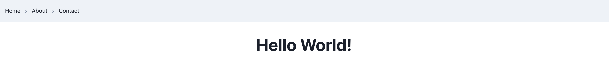

+++
title = 'Create a new React App using chakra-ui components'
date = 2024-01-14T07:07:07+01:00
draft = false
+++
## Introduction
Few days ago, I wished to create a new React App utilizing chakra-ui compnents. Wonder what, I did not find any blog or article that could help me out and get me up to speed quickly. So, I decided to write one for the community. Let's get started.

Assuming that you have `npm` and `node` installed on your system, let's start by creating a new React App. I will be citing references of the blogs and articles that I referred to while creating the app. You can refer to them for more details

Create a new React App using the following command:

```
npx create-react-app my-app --template @chakra-ui
```

This command will create a new folder `my-app` and install all the necessary dependencies required to run the app. Now, navigate to the folder `my-app` and start the development server using the following command:

```
cd my-app
npm start
```

Now, go to file `src/index.js` or `src/index.jsx` and wrap the `App` component with `ChakraProvider` as shown below:

```jsx
import { ChakraProvider, ColorModeScript } from '@chakra-ui/react';
import React, { StrictMode } from 'react';
import * as ReactDOM from 'react-dom/client';
import App from './App';
import reportWebVitals from './reportWebVitals';
import * as serviceWorker from './serviceWorker';

const container = document.getElementById('root');
const root = ReactDOM.createRoot(container);

root.render(
    <StrictMode>
        <ColorModeScript />
            <ChakraProvider>
                <App />
            </ChakraProvider>
    </StrictMode>
);

// If you want your app to work offline and load faster, you can change
// unregister() to register() below. Note this comes with some pitfalls.
// Learn more about service workers: https://cra.link/PWA
serviceWorker.unregister();

// If you want to start measuring performance in your app, pass a function
// to log results (for example: reportWebVitals(console.log))
// or send to an analytics endpoint. Learn more: https://bit.ly/CRA-vitals
reportWebVitals();
```

Everything is now setup, you may navigate to `src/App.js` or `src/App.jsx` and start building your app. I will illustrate how to use chakra-ui breadcrumb component and create a simple navbar using it. Let's create a new folder `components` inside `src` and add a file `navbar.jsx` inside it. Import the necessary components:

```jsx
import {
    Box,
    Flex,
    Breadcrumb,
    BreadcrumbItem,
    BreadcrumbLink,
    useColorModeValue,
} from '@chakra-ui/react'

import {
    ChevronRightIcon,
} from '@chakra-ui/icons'
```

Now, create a helper function to render the breadcrumb items:

```jsx
function BreadCrumb() {
    return (
        <Breadcrumb separator={<ChevronRightIcon color='gray.500' />}>
            <BreadcrumbItem>
                <BreadcrumbLink>Home</BreadcrumbLink>
            </BreadcrumbItem>

            <BreadcrumbItem>
                <BreadcrumbLink>About</BreadcrumbLink>
            </BreadcrumbItem>

            <BreadcrumbItem>
                <BreadcrumbLink>Contact</BreadcrumbLink>
            </BreadcrumbItem>
        </Breadcrumb>
    );
}
```

Then, create a functional component `Navbar`, that will render the breadcrumb items and export it by default:

```jsx
function NavBar() {
    return (
        <Box bg={useColorModeValue('gray.100', 'gray.900')} px={4}>
            <Flex h={16} alignItems={'center'} justifyContent={'space-between'}>
                <BreadCrumb />
            </Flex>
        </Box>
    );
}

export default NavBar;
```

You will need to install chakra-ui/icons using:

```
npm install @chakra-ui/icons
```

Now, you can import the `Navbar` component in `src/App.js` or `src/App.jsx` and render it inside the `App` component:

```jsx
import React from 'react';
import {
  Heading,
} from '@chakra-ui/react';

import NavBar from './components/navbar';

function App() {
  return (
    <div>
      <NavBar />
      <Heading as='h3' size='2xl' textAlign='center' mt='10'>Hello World!</Heading>
    </div>
  );
}

export default App;
```

## Preview



## Conclusion

That's it, you have successfully created a new React App using chakra-ui components. You can now start building your app using chakra-ui components. You can refer to the official documentation of chakra-ui for more details: [chakra-ui](https://chakra-ui.com/)

In the next blog, I will illustrate adding browser routing to the app using `react-router-dom` and creating a multi-page app using chakra-ui components. Stay tuned!
